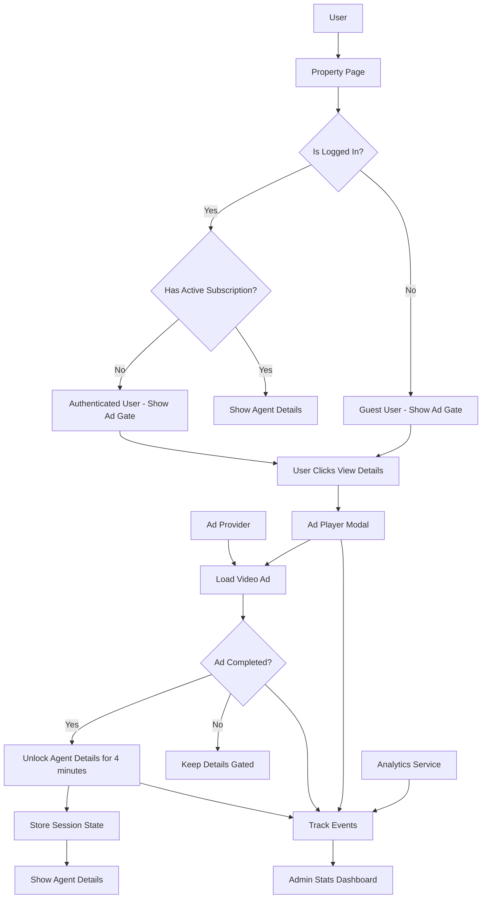
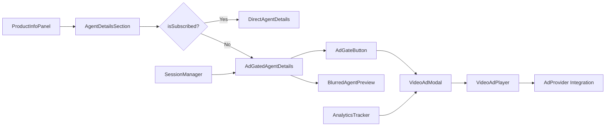

# Design Document

## Overview

The Video Ad Gate for Agent Details feature implements a monetization strategy that requires guest users to watch video advertisements before accessing agent contact information. This system integrates with existing authentication flows while providing a seamless experience for both guest and authenticated users.

## Architecture

### High-Level Architecture



### Component Architecture



## Components and Interfaces

### 1. AdGatedAgentDetails Component

**Purpose**: Manages the display state of agent details for guest users

**Props**:
```typescript
interface AdGatedAgentDetailsProps {
  apartment: Apartment;
  onUnlock: () => void;
  isUnlocked: boolean;
}
```

**Features**:
- Displays blurred/hidden agent contact information
- Shows "View Contact Details" button with ad icon
- Manages unlock state from session storage
- Displays countdown timer for remaining unlock time

### 2. VideoAdModal Component

**Purpose**: Full-screen modal for video advertisement playback

**Props**:
```typescript
interface VideoAdModalProps {
  isOpen: boolean;
  onClose: () => void;
  onAdComplete: () => void;
  onAdSkipped: (watchDuration: number) => void;
  adConfig: AdConfiguration;
}
```

**Features**:
- Full-screen overlay with video player
- Skip button (disabled for first 5 seconds)
- Progress indicator
- Error handling and fallback content
- Analytics event tracking

### 3. VideoAdPlayer Component

**Purpose**: Handles video ad playback with multiple provider support

**Props**:
```typescript
interface VideoAdPlayerProps {
  adConfig: AdConfiguration;
  onComplete: () => void;
  onSkipped: (duration: number) => void;
  onError: (error: Error) => void;
}
```

**Integration Options**:
- Google IMA SDK for VAST/VPAID ads
- Direct video URL playback
- Custom ad network integration
- Fallback promotional content

### 4. AdSessionManager Service

**Purpose**: Manages ad viewing sessions and unlock states

**Interface**:
```typescript
interface AdSessionManager {
  isUnlocked(): boolean;
  setUnlocked(duration: number): void;
  getRemainingTime(): number;
  clearSession(): void;
}
```

**Storage**: Browser sessionStorage for temporary unlock state

### 5. AdAnalytics Service

**Purpose**: Tracks ad-related events for analytics

**Events**:
- `ad_impression`: When ad modal opens
- `ad_started`: When video playback begins
- `ad_completed`: When ad plays to completion
- `ad_skipped`: When user skips after minimum duration
- `agent_details_unlocked`: When contact details become available

## Data Models

### AdConfiguration

```typescript
interface AdConfiguration {
  provider: 'google_ima' | 'google_adsense' | 'custom' | 'fallback';
  vastTag?: string;
  adUnitId?: string;
  customVideoUrl?: string;
  skipDelay: number; // seconds before skip is allowed
  fallbackContent?: {
    videoUrl: string;
    title: string;
    description: string;
  };
}
```

### AdSession

```typescript
interface AdSession {
  unlockedAt: number; // timestamp
  expiresAt: number; // timestamp
  sessionId: string;
}
```

### AdEvent

```typescript
interface AdEvent {
  eventType: 'impression' | 'started' | 'completed' | 'skipped' | 'unlocked';
  timestamp: number;
  sessionId: string;
  apartmentId: string;
  watchDuration?: number;
  adProvider?: string;
}
```

## Integration Points

### 1. Google IMA SDK Integration

**Implementation**:
- Load IMA SDK via CDN or npm package
- Initialize AdDisplayContainer and AdsLoader
- Handle VAST tag requests and ad playback
- Manage ad events and completion callbacks

**Code Structure**:
```typescript
class GoogleIMAProvider implements AdProvider {
  private adsLoader: google.ima.AdsLoader;
  private adsManager: google.ima.AdsManager;
  
  async loadAd(vastTag: string): Promise<void>;
  play(): void;
  pause(): void;
  destroy(): void;
}
```

### 2. Video.js Integration (Alternative)

**Implementation**:
- Use Video.js with videojs-contrib-ads plugin
- Add videojs-ima plugin for Google IMA support
- Configure player with ad settings
- Handle ad lifecycle events

### 3. Custom Video Ad Support

**Implementation**:
- Direct HTML5 video element
- Custom controls and skip functionality
- Manual event tracking
- Fallback for when ad networks are unavailable

## User Experience Flow

### Guest User Journey

1. **Initial State**: User sees property page with agent name and profile picture visible, contact details blurred/hidden
2. **Call-to-Action**: "View Contact Details" button with ad icon and tooltip
3. **Ad Modal**: Full-screen modal opens with video advertisement
4. **Ad Playback**: Video plays with skip button disabled for 5 seconds
5. **Completion**: After ad completion or skip, contact details unlock for 4 minutes
6. **Session Persistence**: Unlocked state maintained across property pages during session
7. **Subscription Access**: Must register/login to access subscription features

### Authenticated Non-Subscribed User Journey

1. **Initial State**: User sees property page with agent name and profile picture visible, contact details blurred/hidden
2. **Call-to-Action**: "View Contact Details" button with ad icon and tooltip
3. **Ad Modal**: Full-screen modal opens with video advertisement
4. **Ad Playback**: Video plays with skip button disabled for 5 seconds
5. **Completion**: After ad completion or skip, contact details unlock for 4 minutes
6. **Session Persistence**: Unlocked state maintained across property pages during session

### Subscribed User Journey

1. **Direct Access**: All agent contact details immediately visible (only for logged-in users with active subscription)
2. **No Ad Gate**: No "View Contact Details" button shown
3. **Full Functionality**: Phone, email, WhatsApp buttons fully accessible

## Error Handling

### Ad Loading Failures

- **Network Issues**: Show retry button with fallback content
- **Ad Blocker Detection**: Display message explaining ad requirement
- **Provider Unavailable**: Fall back to promotional video about platform
- **VAST Errors**: Log error and show alternative ad or fallback

### Session Management Errors

- **Storage Unavailable**: Graceful degradation to per-page unlocks
- **Corrupted Session**: Clear session and require new ad view
- **Expired Session**: Smooth transition back to gated state

## Testing Strategy

### Unit Tests

- AdSessionManager session storage operations
- AdConfiguration validation and provider selection
- VideoAdPlayer event handling and state management
- Analytics event tracking accuracy

### Integration Tests

- Complete ad viewing flow from gate to unlock
- Session persistence across page navigation
- Provider fallback mechanisms
- Authentication state transitions

### End-to-End Tests

- Guest user complete journey (view ad → unlock details)
- Authenticated user bypass flow
- Ad blocker scenarios
- Mobile responsive behavior

### Performance Tests

- Ad loading time measurements
- Video playback performance
- Session storage impact
- Analytics event batching

## Security Considerations

### Client-Side Validation

- Session tampering prevention
- Ad completion verification
- Analytics event integrity

### Privacy Compliance

- No personal data in ad events
- Session-only storage (no persistent tracking)
- GDPR-compliant analytics collection

### Ad Fraud Prevention

- Unique session identifiers
- Completion verification
- Rate limiting for unlock attempts

## Admin Stats Dashboard

### Dashboard Features

**Purpose**: Provides administrators with comprehensive analytics on ad performance and user engagement

**Key Metrics**:
- Total ad impressions (daily, weekly, monthly)
- Ad completion rates vs skip rates
- Average watch duration for skipped ads
- Agent details unlock events
- User engagement patterns (guest vs authenticated)
- Revenue impact metrics

**Dashboard Components**:
```typescript
interface AdStatsDashboard {
  impressions: {
    total: number;
    daily: number[];
    weekly: number[];
    monthly: number[];
  };
  completionRate: number;
  skipRate: number;
  averageWatchDuration: number;
  unlockEvents: {
    total: number;
    byMethod: {
      ad_watched: number;
      subscribed: number;
    };
  };
  userBreakdown: {
    guest: number;
    authenticated: number;
    subscribed: number;
  };
}
```

**Visualizations**:
- Line charts for impression trends
- Pie charts for completion vs skip rates
- Bar charts for user type breakdown
- Heat maps for peak usage times

## Configuration Management

### Environment Variables

```typescript
interface AdConfig {
  GOOGLE_IMA_SDK_URL: string;
  GOOGLE_ADSENSE_CLIENT_ID?: string;
  GOOGLE_AD_MANAGER_NETWORK_CODE?: string;
  CUSTOM_AD_ENDPOINT?: string;
  AD_SKIP_DELAY: number;
  SESSION_DURATION: number; // 240 seconds (4 minutes)
  ANALYTICS_ENDPOINT: string;
}
```

### Admin Configuration

- Ad provider selection (Google AdSense, Ad Manager, Custom)
- VAST tag URLs configuration
- Skip delay timing adjustment
- Session duration settings (4 minutes default)
- Fallback content management
- Analytics dashboard access controls

## Performance Optimization

### Lazy Loading

- Ad SDK loaded only when needed
- Video preloading for faster playback
- Component code splitting

### Caching Strategy

- Ad configuration caching
- Video content caching where possible
- Session state optimization

### Analytics Batching

- Event batching to reduce API calls
- Offline event queuing
- Retry mechanisms for failed events

## Accessibility

### Screen Reader Support

- Proper ARIA labels for ad gate elements
- Announcement of unlock state changes
- Skip button accessibility

### Keyboard Navigation

- Tab navigation through ad controls
- Enter/Space key activation
- Escape key to close modal

### Visual Accessibility

- High contrast mode support
- Reduced motion preferences
- Clear visual indicators for unlock state

## Mobile Considerations

### Responsive Design

- Full-screen ad modal on mobile
- Touch-friendly controls
- Optimized video player for mobile

### Performance

- Reduced video quality options for slower connections
- Progressive loading
- Battery usage optimization

### iOS/Android Specific

- Autoplay policy compliance
- Full-screen video handling
- Back button behavior in modal